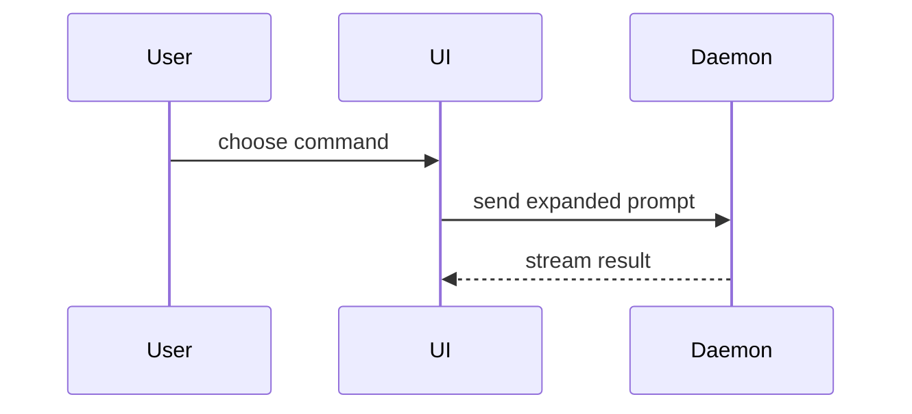

## Body template

Use the repo's `.github/pull_request_template.md` if present. Write to `/tmp/<slug>-pr-body.md`:

````markdown
[TEAM-XXXX](https://company.atlassian.net/browse/TEAM-XXXX)

## Summary

<diagram, diff-sketch, or tree>

- one bullet per logical change, one line each
- imperative verb + object - "add X", "extract Y", "register Z"
- no semicolons, no sub-clauses, no follow-up sentences inside a bullet
- match the bullets to the commits where possible
- describe behaviour and intent, not implementation - say what changed for the user/system, not how
- never leak code into the description

## Evidence

- **Before:** <screenshot/output/failing test run>
- **After:** <screenshot/output/passing test run>

for assets prefer a simple 2 column markdown table with placeholder text to drop assets.

## Sections

Skip all preambles and keep prose brief.

### Issue link detection

Determine the Jira ticket for this PR using a strict precedence - **never infer or substitute**:

When no ticket is detected:

- Title omits the `TEAM-XXXX -` prefix use a conventional-commit prefix instead, matching the repo's `git log --format=%s`).
- Issue Link section in the body is `N/A`.

### Summary

Pick the smallest view that makes the key point clear.

- Show logic or an algorithm as pseudocode:

```text
on(save)
  if content is unchanged
    return cached result
  write new content
  return fresh result
```
````

- Show runtime control flow as a call tree:

```text
submitForm
  createSession
    persistPrompt
    launchAgent
  navigateToSession
```

- Show UI structure as a component tree, including state and module boundaries that matter:

```tsx
<SessionPage>(apps / example / src / routes / session.tsx);
useSessionEvents() < SessionToolbar > <RunSkillButton>(packages / ui);
```

- Show file responsibility or a broad refactor as a shallow file tree:

```text
src/
├── commands/       # parses user actions
├── sessions/       # owns session state
└── transport/      # sends API requests
```

- Show component interaction, control flow, or data flow with Mermaid:



- Use `diff` when the point is what changes and the surrounding shape already exists. Match the diff shape to the topic.

For a component change:

```diff
 <SessionPage>
   useSessionEvents()
   <SessionToolbar>
+    <RunSkillButton />
   <SessionTimeline>
+    <SkillResultCard />
```

For a file-layout change:

```diff
 src/
 ├── commands/
+│   └── show-me.ts       # expands the slash command
 ├── sessions/
-└── transport.ts
+└── transport/
+    ├── client.ts
+    └── stream.ts
```

For a call-tree or call-stack change:

```diff
 submitForm
   createSession
     persistPrompt
+    expandSkillMention
     launchAgent
-  navigateToSession
+  navigateToSession
+    subscribeToEvents
```

For a state or control-flow change:

```diff
 on(save)
-  write content
+  if content is unchanged
+    return cached result
+  write new content
+  invalidate cache
```

- Show the whole block when most of it is new, when omitted context would hide ownership or order, or when the user needs a copyable target shape:

```ts
function expandSkill(command: string): string {
  const skillName = command.slice(1);
  return `use the ${skillName} skill`;
}
```

#### Guidance

Place each visual next to the short text it supports. Keep only the calls, files, props, states, and boundaries needed to answer the user's current question or the options to resolve the current discussion point.

You may use one of these, you may use several, it is unlikely you will use all of them. Use your judgement and don't overwhelm the user.

### Evidence

Concrete evidence that the change works. Show a before and after.

Screenshots are S-tier - when the environment is set up for it and the change is visual.

Execution-based evidence is A-tier. Test results, console output. Show the exact test that now fails and passes, using pseudocode.

### Create

```bash
gh pr create \
  --title "TEAM-XXXX - <desc>" \
  --body-file /tmp/<slug>-pr-body.md \
  ${status:+--draft}   # only when invoked with status=draft
```

### Output - auto-open PR in a new browser tab

After `gh pr create` succeeds, open the PR in the user's browser and print the URL:

```bash
pr_num="$(gh pr view --json number -q .number)"
gh browse "$pr_num"
gh pr view "$pr_num" --json url -q .url
```

Non-negotiable - the whole point of opening a PR is for the user to see it. Print the URL too in case the browser can't open (headless env, missing default browser).

### Monitor - post creation

Check for ci checks failing, if so pull the error and propose a solution.

```bash
gh pr checks --watch
```

There is no native `gh` watch for comments, so use the built-in **Monitor** tool (persistent) with a poll loop that emits one line per new review comment:

```bash
pr=<pr>; repo=<owner>/<name>; prev="$(mktemp)"; : > "$prev"
while true; do
  cur="$(gh api "repos/$repo/pulls/$pr/comments?per_page=100" --jq '.[]|"\(.id) \(.user.login): \(.body|gsub("\n";" ")[0:160])"' 2>/dev/null || true)"
  comm -13 <(sort "$prev") <(printf '%s\n' "$cur" | sort)
  printf '%s\n' "$cur" | sort > "$prev"; sleep 30
done
```

When a reviewer, human or a bot, leaves feedback > invoke the `/pr-feedback` skill to address those comments.

### Hard rules

- `--body-file` only; never `--body` / `-b`.
- Single hyphens (`-`), never em dashes (`—`).
- No `Co-Authored-By` or harness specific AI-attribution trailers of the like.
- No code identifiers in the body (class names, utilities, prop/function/file names) - describe in plain language.
- Confirm with the user before running `gh pr create`.
